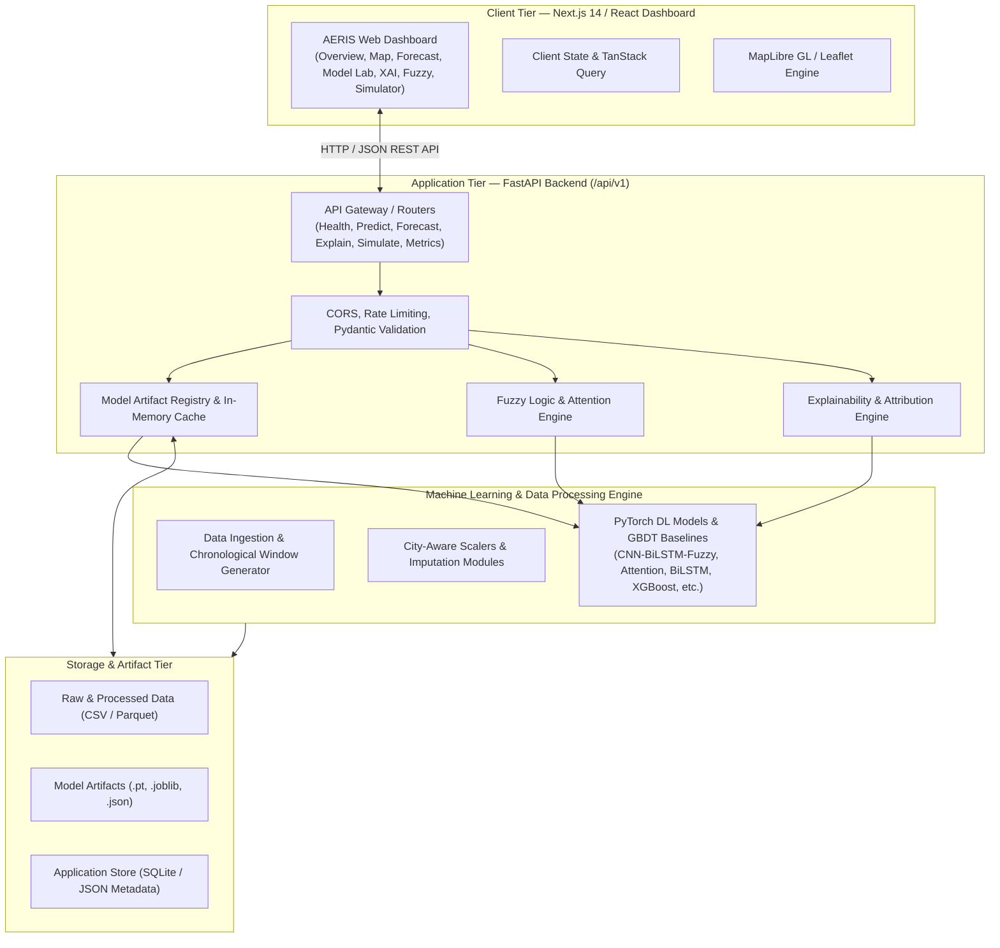
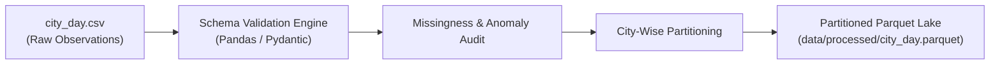
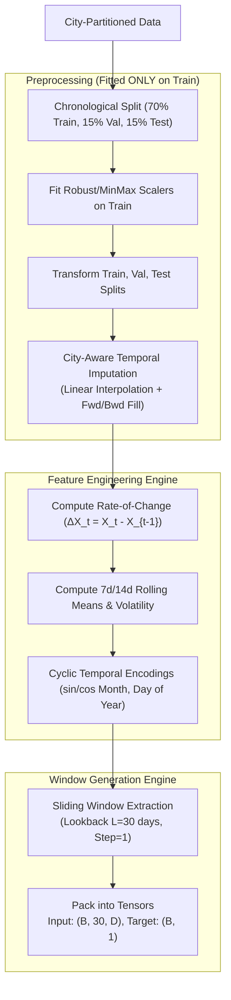
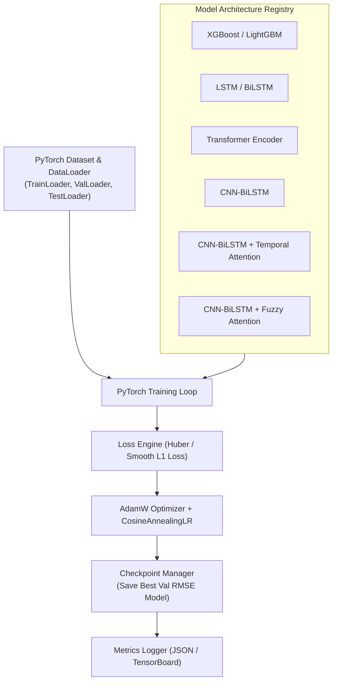
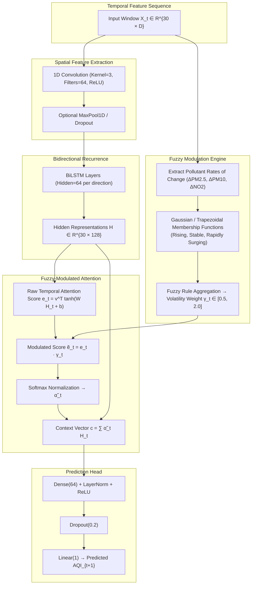
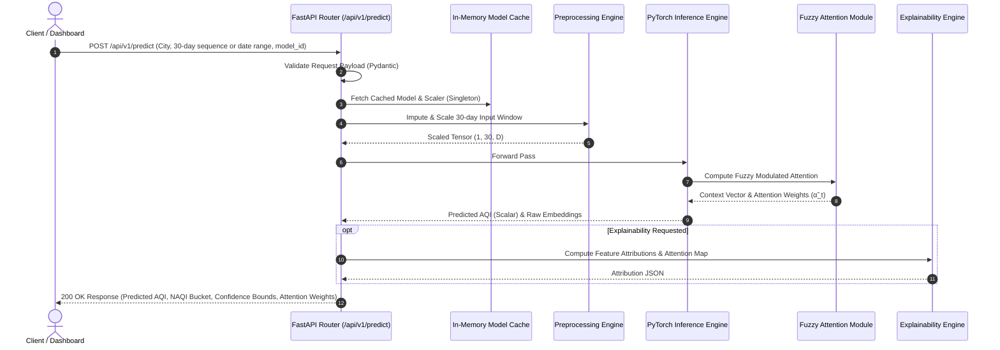
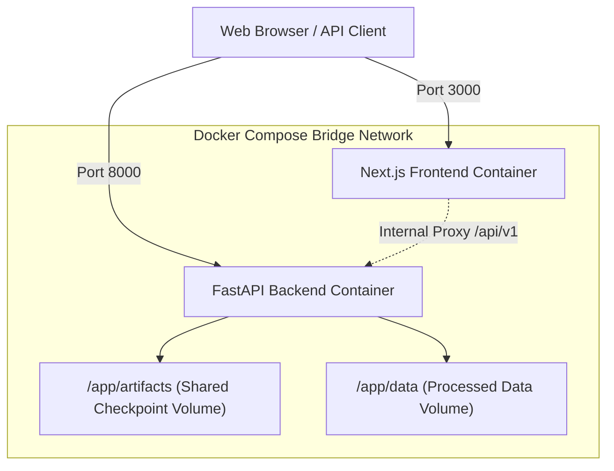

# AERIS: System Architecture & Design Specification
**Adaptive Environmental Risk & Intelligence System**
*System Architecture & Data Pipeline Specification*

---

## 1. High-Level System Architecture

AERIS is structured as a modular, three-tier architecture comprising an **Analytical Frontend (Next.js/React)**, a **High-Performance API Service (FastAPI/Python)**, and a **Machine Learning Core (PyTorch/Scikit-learn/XGBoost)** backed by a structured file and database storage layer.



---

## 2. Technology Stack Evaluation & Rationale

| Layer | Selected Technology | Alternative Considered | Selection Rationale |
| :--- | :--- | :--- | :--- |
| **Frontend Framework** | **Next.js 14 (App Router) + TypeScript** | Vite + React SPA | Server-side rendering, file-based routing, robust production build tooling, and native TypeScript support. |
| **Styling & Components** | **Tailwind CSS + shadcn/ui** | Material UI / AntD | Lightweight, highly customizable, headless accessible primitives with dark-mode aesthetic support. |
| **Visualization** | **Recharts + Lucide Icons** | Chart.js / D3.js | Declarative React-native SVG chart rendering for complex multi-line, area, and attention heatmaps. |
| **Geospatial Mapping** | **MapLibre GL JS / Leaflet** | Google Maps API | Open-source, high-performance vector rendering for Indian city-level geospatial coordinates without API cost/keys. |
| **Backend Framework** | **FastAPI + Pydantic v2** | Flask / Django | Asynchronous ASGI performance, automatic OpenAPI documentation, strict request/response data validation. |
| **ML Framework** | **PyTorch 2.x** | TensorFlow / Keras | Dynamic computational graphs, seamless custom attention and fuzzy modulation implementations. |
| **Tabular & GBDT** | **XGBoost + LightGBM + Scikit-Learn** | CatBoost | Industry-standard high-performance gradient boosting baselines for time-series tabular comparison. |
| **Data Storage** | **Parquet + SQLite + JSON** | PostgreSQL / Kafka | Low-overhead, zero-maintenance, file-based storage perfectly sized for multi-city historical daily records. |
| **Containerization** | **Docker + Docker Compose** | Kubernetes | Simple, reproducible, portable local and cloud deployment without distributed orchestration overhead. |

---

## 3. Data Ingestion Architecture

The ingestion pipeline handles multi-year, multi-pollutant tabular records from Central Pollution Control Board (CPCB) stations across India.



### Ingestion Specifications
1. **Schema Validation:** Checks for mandatory columns (`City`, `Date`, pollutant columns, `AQI`).
2. **Type Enforcement:** Converts `Date` to `datetime64[ns]` and all pollutant concentrations to `float32`.
3. **Partitioning:** Separates data into discrete city-wise time-series containers to prevent cross-city contamination during subsequent temporal operations.

---

## 4. Data Preprocessing & Feature Engineering Pipeline

Preprocessing enforces strict chronological isolation to prevent future-to-past data leakage.



---

## 5. Model Training Architecture

The training architecture supports modular execution for all 8 model families with early stopping, learning rate scheduling, gradient clipping, and metric logging.



---

## 6. Fuzzy Attention Architecture

The novel **Fuzzy Temporal Attention** engine introduces domain-informed environmental volatility modeling directly into the neural attention computation.



---

## 7. Model Inference & Serving Architecture

Inference is optimized for fast, deterministic execution within the FastAPI backend service.



---

## 8. Backend Architecture (FastAPI)

The backend follows clean layered architecture principles:

* **Routers (`/api/v1/`):** Route handling, request validation, and HTTP response formatting.
* **Services:** Business logic for forecasting, what-if simulations, fuzzy analysis, and metric retrieval.
* **Core Engine:** Preprocessing transformations, PyTorch model loaders, and mathematical fuzzy logic modules.
* **Schemas:** Pydantic models enforcing strict input and output contracts.

```
backend/
├── app/
│   ├── api/
│   │   ├── v1/
│   │   │   ├── endpoints/
│   │   │   │   ├── health.py
│   │   │   │   ├── cities.py
│   │   │   │   ├── predict.py
│   │   │   │   ├── forecast.py
│   │   │   │   ├── models.py
│   │   │   │   ├── metrics.py
│   │   │   │   ├── explain.py
│   │   │   │   ├── fuzzy.py
│   │   │   │   └── simulate.py
│   │   │   └── api_router.py
│   ├── core/
│   │   ├── config.py
│   │   └── errors.py
│   ├── models/
│   │   ├── model_registry.py
│   │   └── pytorch_models.py
│   ├── schemas/
│   │   ├── predict_schema.py
│   │   ├── forecast_schema.py
│   │   ├── explain_schema.py
│   │   ├── fuzzy_schema.py
│   │   └── metrics_schema.py
│   ├── services/
│   │   ├── forecast_service.py
│   │   ├── fuzzy_service.py
│   │   ├── explain_service.py
│   │   └── simulation_service.py
│   └── main.py
```

---

## 9. Frontend Architecture (Next.js 14 App Router)

The dashboard provides an intuitive, data-dense interface designed for analytical clarity and rapid navigation.

```
frontend/
├── src/
│   ├── app/
│   │   ├── layout.tsx
│   │   ├── page.tsx (Redirect to /overview)
│   │   ├── overview/page.tsx
│   │   ├── map/page.tsx
│   │   ├── forecast/page.tsx
│   │   ├── model-lab/page.tsx
│   │   ├── explainability/page.tsx
│   │   ├── fuzzy/page.tsx
│   │   ├── simulator/page.tsx
│   │   ├── data-explorer/page.tsx
│   │   └── system/page.tsx
│   ├── components/
│   │   ├── common/ (Header, Sidebar, CitySelector, DatePicker, NAQIBadge)
│   │   ├── charts/ (AQITrendChart, AttentionHeatmap, PollutantBarChart, LossCurve)
│   │   ├── map/ (IndiaAirQualityMap, MapTooltip, LayerControl)
│   │   └── ui/ (shadcn primitives: Button, Card, Dialog, Slider, Tabs, etc.)
│   ├── lib/
│   │   ├── api.ts (Typed fetch client)
│   │   ├── constants.ts (NAQI ranges, color mappings)
│   │   └── utils.ts
│   └── types/
│       ├── api.d.ts
│       └── models.d.ts
```

---

## 10. Storage Architecture

```
AERIS Storage Structure:
├── data/
│   ├── raw/
│   │   └── city_day.csv              # Historical CPCB daily dataset
│   ├── processed/
│   │   ├── city_day_cleaned.parquet  # Imputed, validated dataset
│   │   ├── train_windows.npy         # Sliding sequence inputs (N, 30, D)
│   │   ├── val_windows.npy
│   │   ├── test_windows.npy
│   │   └── metadata.json             # Feature names, scaler params, city lists
├── artifacts/
│   ├── scalers/
│   │   └── robust_scaler.joblib      # Fitted feature scalers
│   ├── checkpoints/
│   │   ├── xgboost_baseline.joblib
│   │   ├── lightgbm_baseline.joblib
│   │   ├── lstm.pt
│   │   ├── bilstm.pt
│   │   ├── transformer.pt
│   │   ├── cnn_bilstm.pt
│   │   ├── cnn_bilstm_temp_attn.pt
│   │   └── cnn_bilstm_fuzzy_attn.pt  # Flagship research model
│   └── metrics/
│       ├── benchmark_summary.json    # Consolidated test metrics
│       └── ablation_results.json
```

---

## 11. Deployment Architecture

A single-host Docker Compose orchestrates the frontend and backend services in an isolated virtual bridge network.



---

## 12. Component Responsibilities & Inter-Component Communication

1. **Preprocessing & Sequence Generator:** Reads raw CSV, handles imputation, applies scaling, and produces unified `(B, 30, D)` arrays.
2. **Model Registry:** Loads PyTorch weights and Scikit-learn/LightGBM pipelines on backend startup; caches models in memory as singletons.
3. **Fuzzy Logic Service:** Computes rate-of-change metrics, evaluates Gaussian/Trapezoidal fuzzy sets, and passes weights to model forward passes.
4. **FastAPI Endpoints:** Receives JSON requests, coordinates feature extraction and model inference, formats responses with NAQI categorization.
5. **Next.js Client:** Queries API via typed client with TanStack Query caching, rendering interactive Recharts and MapLibre visualizations.

---

## 13. Error Handling Strategy & System Resilience

* **Schema Validation Errors:** FastAPI automatically intercepts malformed payloads and returns RFC 7807 compliant `422 Unprocessable Entity` responses.
* **Missing Feature Imputation:** If a single day within a 30-day lookback is missing individual pollutant readings during user inference, the backend applies local spline/linear interpolation rather than failing.
* **Out-of-Distribution Inputs:** What-if simulator clamps pollutant adjustments within physical bounds (e.g., non-negative concentrations, reasonable maximum limits) and returns informative warnings.
* **Model Inference Fallback:** If a requested advanced model fails to execute, the system returns a descriptive `500 Internal Server Error` with diagnostic stack traces logged locally, without crashing the ASGI worker.
