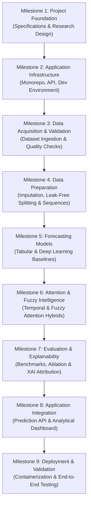

# AERIS: Engineering Roadmap & Milestones
**Adaptive Environmental Risk & Intelligence System**

---

## 1. Roadmap Overview & Execution Strategy

AERIS is organized into nine sequential engineering milestones. Each milestone defines explicit prerequisites, deliverables, and verification criteria to ensure systematic progress from foundational research to application deployment.

---

## 2. Milestone Breakdown

---

### Milestone 1 — Project Foundation
* **Status:** `Complete`
* **Objective:** Establish the comprehensive technical requirements, system architecture, research baseline, mathematical formulations, API contracts, and user interface designs.
* **Key Tasks:**
  1. Author foundational project specification (`PROJECT_SPEC.md`).
  2. Design complete system architecture and data pipelines (`ARCHITECTURE.md`).
  3. Formulate research baseline and anti-leakage evaluation protocols (`RESEARCH_BASELINE.md`).
  4. Specify deep learning and tabular model mathematics (`MODEL_SPECIFICATION.md`).
  5. Define OpenAPI 3.1 REST contracts (`API_SPECIFICATION.md`).
  6. Blueprint user interface layouts and analytical views (`DASHBOARD_SPECIFICATION.md`).
* **Deliverables:** Complete root technical documentation suite.
* **Completion Criteria:** All specifications authored, peer-reviewed, and cross-consistent.

---

### Milestone 2 — Application Infrastructure
* **Status:** `Complete`
* **Objective:** Establish a clean, maintainable development environment for Python backend services and Next.js frontend clients.
* **Key Tasks:**
  1. Initialize Python environment with FastAPI, PyTorch, Pydantic, Scikit-learn, XGBoost, and LightGBM.
  2. Initialize Next.js 14 frontend with TypeScript, Tailwind CSS, and headless components.
  3. Configure code quality tools (`ruff`, `pytest`, `eslint`, `prettier`).
  4. Implement application core (`config`, `logging`, RFC 7807 error handling).
  5. Implement and verify `/api/v1/health` endpoint.
  6. Configure multi-stage Dockerfiles and Docker Compose.
* **Deliverables:** Operational backend API, frontend dev shell, and container definitions.
* **Completion Criteria:** Backend unit tests pass (`pytest`); frontend compiles (`next build`); health endpoint returns HTTP 200.

---

### Milestone 3 — Data Acquisition and Validation
* **Status:** `Complete`
* **Objective:** Ingest, validate, and store the historical multi-city Indian air quality dataset.
* **Key Tasks:**
  1. Ingest `city_day.csv` into `data/raw/`.
  2. Build schema validation engine to enforce column types and structure.
  3. Profile missing data distributions and temporal continuity across cities.
  4. Save validated, city-partitioned Parquet tables in `data/processed/`.
* **Deliverables:** `src/data/ingestion.py`, `src/data/schema.py`, validation test suite, and data profile summary.
* **Dependencies:** Milestone 2.
* **Completion Criteria:** Ingestion pipeline parses 100% of rows without unhandled exceptions; missingness distributions documented.

---

### Milestone 4 — Data Preparation
* **Status:** `Complete`
* **Objective:** Implement leak-free chronological partitioning, city-aware missing value imputation, and StandardScaler normalization.
* **Key Tasks:**
  1. Partition data chronologically (70% Train, 15% Validation, 15% Test) strictly within individual cities.
  2. Fit scalers (`RobustScaler` / `MinMaxScaler`) strictly on the training partition; serialize to `artifacts/scalers/`.
  3. Apply localized linear interpolation for small gaps ($\le 5$ days) and forward/backward padding.
  4. Compute pollutant rates of change ($\text{ROC}$) and rolling volatility statistics.
  5. Generate sliding lookback windows of 30 days ($T=30$) mapped to target $\text{AQI}_{t+1}$.
* **Deliverables:** `src/preprocessing/`, `src/features/`, and formatted numpy sequence arrays (`X_train.npy`, `y_train.npy`, etc.).
* **Dependencies:** Milestone 3.
* **Completion Criteria:** Zero temporal leakage across partition boundaries; sliding windows verified via automated tests.

---

### Milestone 5 — Forecasting Models
* **Status:** `Pending`
* **Objective:** Implement and train baseline tabular and sequential deep-learning architectures.
* **Key Tasks:**
  1. Train tabular baselines (XGBoost, LightGBM) on flattened sequence and lag features.
  2. Implement PyTorch DataLoader pipelines with batching and memory pinning.
  3. Implement and train standard LSTM baseline (`src/models/lstm.py`).
  4. Implement and train Bidirectional LSTM baseline (`src/models/bilstm.py`).
  5. Implement and train Transformer Encoder baseline (`src/models/transformer.py`).
  6. Implement hybrid 1D-CNN + BiLSTM architecture (`src/models/cnn_bilstm.py`).
* **Deliverables:** Serialized baseline checkpoints in `artifacts/checkpoints/`.
* **Dependencies:** Milestone 4.
* **Completion Criteria:** All baseline models achieve training convergence and generate valid scalar predictions.

---

### Milestone 6 — Attention and Fuzzy Intelligence
* **Status:** `Pending`
* **Objective:** Integrate temporal attention and develop the proposed fuzzy logic-modulated attention mechanism.
* **Key Tasks:**
  1. Implement Bahdanau-style temporal attention over BiLSTM hidden states (`src/models/attention.py`).
  2. Implement fuzzy membership functions (Gaussian, Trapezoidal) for pollutant rate-of-change inputs (`src/fuzzy/membership.py`).
  3. Implement fuzzy rule aggregation to compute temporal volatility multipliers $\gamma_t \in [0.5, 2.0]$.
  4. Modulate temporal attention energies ($\tilde{e}_t = e_t \cdot \gamma_t$) and normalize via softmax.
  5. Train and serialize the flagship `cnn_bilstm_fuzzy_attn.pt` model.
* **Deliverables:** `src/fuzzy/`, `src/models/fuzzy_attention_model.py`, and trained model weights.
* **Dependencies:** Milestone 5.
* **Completion Criteria:** Attention weights satisfy $\sum \alpha_t = 1.0$; fuzzy multipliers dynamically scale during high $\text{ROC}$ periods.

---

### Milestone 7 — Evaluation and Explainability
* **Status:** `Pending`
* **Objective:** Conduct rigorous multi-model benchmarking, execute systematic ablation experiments, and build explainability modules.
* **Key Tasks:**
  1. Evaluate all 8 model families on the held-out test partition.
  2. Compute regression metrics (RMSE, MAE, $R^2$, MAPE) and classification metrics (NAQI Accuracy, Macro F1, Severe Recall).
  3. Execute ablation grid (isolating Conv1D, BiLSTM, Attention, and Fuzzy ROC contributions).
  4. Implement feature attribution (Integrated Gradients / Permutation Importance) and temporal attention extractors.
  5. Implement counterfactual What-If scenario simulation engine.
* **Deliverables:** `reports/benchmark_summary.json`, `reports/ablation_study.json`, and `src/xai/`.
* **Dependencies:** Milestone 6.
* **Completion Criteria:** Complete benchmark comparison generated with zero missing test evaluations.

---

### Milestone 8 — Application Integration
* **Status:** `Pending`
* **Objective:** Expose trained models through the FastAPI backend and connect all 9 analytical views in the Next.js dashboard.
* **Key Tasks:**
  1. Implement in-memory `ModelRegistry` in FastAPI to serve trained PyTorch and GBDT models.
  2. Implement prediction, forecast, metrics, explainability, fuzzy analysis, and simulation endpoints under `/api/v1`.
  3. Build full Next.js UI views (Overview, Air Quality Map, Forecast Studio, Model Lab, Explainability, Fuzzy Intelligence, What-If Simulator, Data Explorer, System).
  4. Connect frontend components to backend endpoints via typed API client.
* **Deliverables:** Fully integrated web dashboard and operational REST API.
* **Dependencies:** Milestone 7.
* **Completion Criteria:** All 9 dashboard pages display live backend data; end-to-end prediction flow executes in $< 200\,\text{ms}$.

---

### Milestone 9 — Deployment and Validation
* **Status:** `Pending`
* **Objective:** Execute full system integration testing, optimize container builds, and prepare production deployment artifacts.
* **Key Tasks:**
  1. Author end-to-end integration test suite (`tests/test_e2e.py`).
  2. Optimize Docker multi-stage build layers for minimal image size.
  3. Validate container networking, volume mounts, and service health checks via Docker Compose.
  4. Document deployment procedures and environment configuration.
* **Deliverables:** Validated Docker Compose deployment, comprehensive test logs, and final documentation.
* **Dependencies:** Milestone 8.
* **Completion Criteria:** Single command `docker compose up --build` brings up healthy frontend and backend services; all integration tests pass.

---

## 3. Engineering Decisions & Empirical Validation Tracker

The following architectural and methodological choices are tracked for empirical resolution during development:

| Decision ID | Topic | Options Evaluated | Target Milestone | Rationale & Resolution Criteria |
| :--- | :--- | :--- | :--- | :--- |
| **DEC-01** | Feature Scaler Selection | `RobustScaler` vs `MinMaxScaler` | Milestone 4 | Evaluate whether `RobustScaler` better preserves extreme upper-tail pollution peaks without compressing standard values. |
| **DEC-02** | Imputation Strategy for Volatiles | Spline Interpolation vs Iterative Imputer (MICE) vs Zero-masking | Milestone 4 | Compare reconstruction error on artificially masked test intervals for volatile organic compounds. |
| **DEC-03** | Loss Function Selection | MSE vs Huber Loss vs Quantile Loss | Milestone 5 | Huber loss provides robust quadratic behavior for standard errors and linear penalty for extreme outliers, preventing gradient explosion. |
| **DEC-04** | Fuzzy Membership Adaptation | Fixed Expert Curves vs Learnable Parameters | Milestone 6 | Benchmark fixed Gaussian/Trapezoidal sets against backpropagation-updated membership parameters. |
| **DEC-05** | Map Rendering Engine | MapLibre GL JS vs Leaflet | Milestone 8 | MapLibre provides superior vector performance for national coordinates; Leaflet offers zero-dependency simplicity. |
| **DEC-06** | Scenario State Storage | In-memory cache vs Embedded SQLite | Milestone 8 | SQLite provides zero-configuration local persistence for user-created What-If scenarios without external database daemons. |
