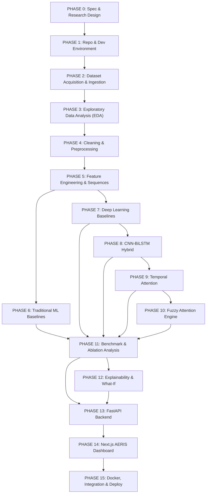

# AERIS: Development Plan & Implementation Roadmap
**Adaptive Environmental Risk & Intelligence System**
*Document Version: 1.0.0 — Phase 0 Roadmap*
*Date: September 2026*

---

## 1. Roadmap Overview & Execution Strategy

AERIS is structured across 16 systematic phases (Phase 0 through Phase 15). Each phase is engineered as an incremental, testable, and dependency-isolated milestone designed for a senior developer/researcher. A phase is considered complete **only after its explicit acceptance criteria and automated tests have passed**.

---

## 2. Phase-by-Phase Execution Plan

---

### PHASE 0 — Project Specification & Research Design
* **Objective:** Establish the exhaustive architectural blueprint, research methodology, mathematical formulations, API contracts, and UI design specifications.
* **Prerequisites:** Workspace initialization.
* **Detailed Tasks:**
  1. Inspect existing workspace environment.
  2. Author `PROJECT_SPEC.md`, `ARCHITECTURE.md`, `DEVELOPMENT_PLAN.md`, `RESEARCH_BASELINE.md`, `MODEL_SPECIFICATION.md`, `API_SPECIFICATION.md`, and `DASHBOARD_SPECIFICATION.md`.
  3. Validate cross-document consistency and verify all 22 Phase 0 criteria.
* **Expected Files / Modules:** 7 root markdown specifications.
* **Expected Outputs:** Complete, immutable architectural and research design specification.
* **Dependencies:** None.
* **Acceptance Criteria:** All 7 documents authored, internally consistent, with zero application code or premature package installation.
* **Verification & Testing:** Manual cross-document audit against Phase 0 requirements.
* **Definition of Done:** All 7 files committed in root workspace.

---

### PHASE 1 — Repository & Development Environment
* **Objective:** Configure a clean, reproducible monorepo environment for Python (backend & ML) and Node.js/TypeScript (frontend).
* **Prerequisites:** Phase 0 completion.
* **Detailed Tasks:**
  1. Initialize Python virtual environment with Poetry / `requirements.txt` (PyTorch 2.x, Pandas, Scikit-learn, XGBoost, LightGBM, FastAPI, Uvicorn, Pydantic).
  2. Initialize Next.js 14 frontend workspace with TypeScript, Tailwind CSS, and shadcn/ui.
  3. Establish linting and formatting standards (`black`, `flake8`, `isort`, `eslint`, `prettier`).
  4. Setup root `.gitignore`, directory structures, and initial test runners (`pytest`, `jest`).
* **Expected Files / Modules:** `backend/`, `frontend/`, `data/`, `artifacts/`, `tests/`, `pyproject.toml` / `requirements.txt`, `package.json`.
* **Expected Outputs:** Operational test runners passing empty smoke tests; working virtual environments.
* **Dependencies:** Phase 0.
* **Acceptance Criteria:** `pytest` runs and passes; `npm run build` compiles without errors.
* **Verification & Testing:** CLI verification of Python and Node environments.
* **Definition of Done:** Clean monorepo structure with automated formatting and zero dependency conflicts.

---

### PHASE 2 — Dataset Acquisition & Data Ingestion
* **Objective:** Acquire, validate, and store the historical Indian daily air quality dataset (`city_day.csv`).
* **Prerequisites:** Phase 1 completion.
* **Detailed Tasks:**
  1. Place raw `city_day.csv` in `data/raw/`.
  2. Implement `src/data/ingestion.py` to parse CSV, enforce strict schema validation, and detect missing or malformed records.
  3. Partition records by city and save optimized intermediate Parquet tables (`data/processed/city_day_raw.parquet`).
* **Expected Files / Modules:** `src/data/ingestion.py`, `src/data/schema.py`, `tests/test_ingestion.py`.
* **Expected Outputs:** Validated city-partitioned Parquet files and ingestion audit log.
* **Dependencies:** Phase 1.
* **Acceptance Criteria:** 100% of rows parsed, invalid dates or corrupted types flagged; unit test coverage $\ge 90\%$.
* **Verification & Testing:** Pytest suite verifying schema conformity and null-check alerts.
* **Definition of Done:** Ingestion pipeline runs deterministically and exports structured Parquet artifacts.

---

### PHASE 3 — Exploratory Data Analysis & Data Quality
* **Objective:** Quantify missingness patterns, pollutant distributions, temporal coverage, and seasonal variations across Indian cities.
* **Prerequisites:** Phase 2 completion.
* **Detailed Tasks:**
  1. Implement automated EDA scripts generating summary statistics for all 12 pollutant features and composite AQI.
  2. Compute city-wise missing data percentage tables and identify contiguous data spans.
  3. Analyze cross-pollutant Pearson/Spearman correlations and seasonal distributions.
  4. Generate visual EDA summaries (`reports/figures/missingness_heatmap.png`, `reports/figures/correlation_matrix.png`).
* **Expected Files / Modules:** `src/eda/data_profiler.py`, `notebooks/01_exploratory_data_analysis.ipynb`, `reports/eda_summary.json`.
* **Expected Outputs:** Data quality report documenting missing value strategies and candidate city selection.
* **Dependencies:** Phase 2.
* **Acceptance Criteria:** Comprehensive missingness matrix documented; top data-complete cities identified.
* **Verification & Testing:** Validation script verifying no unrecorded null patterns.
* **Definition of Done:** Detailed EDA report generated with clear imputation guidelines.

---

### PHASE 4 — Data Cleaning & Preprocessing
* **Objective:** Execute city-aware, leakage-free data imputation, outlier mitigation, and feature scaling.
* **Prerequisites:** Phase 3 completion.
* **Detailed Tasks:**
  1. Implement chronological split logic (70% Train, 15% Validation, 15% Test) strictly per city.
  2. Implement city-aware interpolation: linear interpolation for internal gaps $\le 5$ days; boundary forward/backward fill.
  3. Fit `RobustScaler` / `MinMaxScaler` **strictly on the Train split**; serialize scalers to `artifacts/scalers/`.
  4. Transform Validation and Test splits using the fitted training scalers.
* **Expected Files / Modules:** `src/preprocessing/cleaner.py`, `src/preprocessing/scaler.py`, `tests/test_preprocessing.py`.
* **Expected Outputs:** Cleaned Parquet datasets and serialized scaler artifacts (`scaler.joblib`).
* **Dependencies:** Phase 3.
* **Acceptance Criteria:** Zero lookahead leakage; scalers fitted exclusively on Train data; test suite verifies zero NaNs in output.
* **Verification & Testing:** Unit tests asserting scaler statistics match training partition only.
* **Definition of Done:** Cleaned splits saved to `data/processed/` with passing integrity tests.

---

### PHASE 5 — Feature Engineering & Sequence Generation
* **Objective:** Extract pollutant rates-of-change, rolling statistics, cyclic time encodings, and construct sliding 30-day temporal tensors.
* **Prerequisites:** Phase 4 completion.
* **Detailed Tasks:**
  1. Compute 1st-order rate-of-change ($\text{ROC}$): $\Delta X_t = X_t - X_{t-1}$ for major pollutants ($\text{PM}_{2.5}, \text{PM}_{10}, \text{NO}_2, \text{SO}_2, \text{CO}, \text{O}_3$).
  2. Compute 7-day and 14-day rolling means and standard deviations.
  3. Generate cyclic features ($\sin/\cos$ of Month and Day-of-Year).
  4. Implement sliding window generator: Lookback $L=30$ days, step $s=1$ day, target $Y = \text{AQI}_{t+1}$.
  5. Enforce city boundary isolation (windows never bridge two cities or cross split boundaries).
* **Expected Files / Modules:** `src/features/feature_builder.py`, `src/features/sequence_generator.py`, `tests/test_sequences.py`.
* **Expected Outputs:** Tensors: `X_train.npy` $(N_{tr}, 30, D)$, `y_train.npy` $(N_{tr}, 1)$, `X_val.npy`, `y_val.npy`, `X_test.npy`, `y_test.npy`.
* **Dependencies:** Phase 4.
* **Acceptance Criteria:** Correct 3D tensor shapes; exact temporal alignment verified; zero window leakage across boundaries.
* **Verification & Testing:** Pytest checking sequence continuity, shape invariants, and boundary flags.
* **Definition of Done:** Formatted numpy/PyTorch dataset arrays saved and validated.

---

### PHASE 6 — Traditional ML Baselines
* **Objective:** Implement, optimize, and evaluate tabular baseline models (XGBoost, LightGBM).
* **Prerequisites:** Phase 5 completion.
* **Detailed Tasks:**
  1. Implement window-flattening and lag-aggregation transform for tabular models (mapping $(30, D) \to$ 1D feature vector).
  2. Train XGBoost regressor with hyperparameter tuning (max_depth, n_estimators, learning_rate).
  3. Train LightGBM regressor with early stopping on validation split.
  4. Log test metrics: RMSE, MAE, $R^2$, MAPE, NAQI Accuracy, Macro F1.
  5. Serialize trained baseline models to `artifacts/checkpoints/`.
* **Expected Files / Modules:** `src/models/xgboost_model.py`, `src/models/lightgbm_model.py`, `tests/test_tabular_models.py`.
* **Expected Outputs:** Serialized `.joblib` models and `reports/metrics_traditional_baselines.json`.
* **Dependencies:** Phase 5.
* **Acceptance Criteria:** Baselines train without errors; evaluation output matches standard metric schema.
* **Verification & Testing:** Automated test checking inference on dummy batch $(1, 30 \times D)$.
* **Definition of Done:** XGBoost and LightGBM models trained, evaluated, and serialized with logged metrics.

---

### PHASE 7 — Deep Learning Baselines
* **Objective:** Implement and train standard sequential deep learning baselines (LSTM, BiLSTM, Transformer Encoder).
* **Prerequisites:** Phase 5 completion.
* **Detailed Tasks:**
  1. Build PyTorch `Dataset` and `DataLoader` pipelines with pin memory and batch shuffling for training.
  2. Implement standard multi-layer LSTM model (`src/models/lstm.py`).
  3. Implement Bidirectional LSTM (`src/models/bilstm.py`).
  4. Implement Transformer Encoder with positional encodings (`src/models/transformer.py`).
  5. Implement shared training loop with AdamW, Cosine Annealing, Early Stopping, and Huber Loss.
  6. Evaluate models on test set and serialize best weights (`.pt`).
* **Expected Files / Modules:** `src/models/lstm.py`, `src/models/bilstm.py`, `src/models/transformer.py`, `src/training/trainer.py`, `tests/test_dl_baselines.py`.
* **Expected Outputs:** Checkpoints: `lstm.pt`, `bilstm.pt`, `transformer.pt`; metric JSON reports.
* **Dependencies:** Phase 5.
* **Acceptance Criteria:** Loss converges; reproducible evaluation metrics computed on test fold.
* **Verification & Testing:** Pytest unit tests verifying forward pass tensor shapes $(B, 30, D) \to (B, 1)$.
* **Definition of Done:** All 3 deep learning baselines trained, evaluated, and checkpointed.

---

### PHASE 8 — CNN-BiLSTM Hybrid Architecture
* **Objective:** Implement and evaluate the hybrid 1D-CNN + BiLSTM architecture for joint spatio-temporal feature extraction.
* **Prerequisites:** Phase 7 completion.
* **Detailed Tasks:**
  1. Design 1D Convolutional feature extractor (Conv1D + LayerNorm + ReLU + Dropout) to capture local multi-pollutant correlations across adjacent time steps.
  2. Connect Conv1D output directly to 2-layer BiLSTM.
  3. Implement prediction head mapping final hidden state concatenation $(h_{forward} \oplus h_{backward})$ to continuous AQI.
  4. Train with Huber loss and log training/validation curves.
* **Expected Files / Modules:** `src/models/cnn_bilstm.py`, `tests/test_cnn_bilstm.py`.
* **Expected Outputs:** Model artifact `cnn_bilstm.pt` and training telemetry logs.
* **Dependencies:** Phase 7.
* **Acceptance Criteria:** Model achieves training convergence; forward pass handles variable batch sizes without shape errors.
* **Verification & Testing:** Automated shape assertions and gradient backprop check.
* **Definition of Done:** Hybrid CNN-BiLSTM trained, evaluated, and benchmarked against standard BiLSTM.

---

### PHASE 9 — Temporal Attention Mechanism
* **Objective:** Introduce a Bahdanau-style temporal attention mechanism over the BiLSTM hidden states to weight significant historical days.
* **Prerequisites:** Phase 8 completion.
* **Detailed Tasks:**
  1. Implement Temporal Attention Layer: $e_t = v^T \tanh(W H_t + b)$, $\alpha_t = \text{Softmax}(e_t)$, Context $c = \sum \alpha_t H_t$.
  2. Implement extraction method to return attention weight vector $\alpha \in \mathbb{R}^{30}$ alongside the predicted AQI.
  3. Train CNN-BiLSTM + Temporal Attention model.
  4. Generate sample attention heatmaps over 30-day lookback sequences.
* **Expected Files / Modules:** `src/models/attention.py`, `src/models/cnn_bilstm_attention.py`, `tests/test_attention.py`.
* **Expected Outputs:** Checkpoint `cnn_bilstm_temp_attn.pt` and attention extraction utilities.
* **Dependencies:** Phase 8.
* **Acceptance Criteria:** Attention weights sum to $1.0 \pm 10^{-6}$ per sample; model yields extractable attention distributions.
* **Verification & Testing:** Unit test validating $\sum_{t=1}^{30} \alpha_t = 1$ and tensor dimensions.
* **Definition of Done:** Temporal attention model fully trained, evaluated, and verified.

---

### PHASE 10 — Fuzzy Attention & Research Experiments
* **Objective:** Implement the flagship research model: CNN-BiLSTM with Fuzzy Logic-Modulated Temporal Attention.
* **Prerequisites:** Phase 9 completion.
* **Detailed Tasks:**
  1. Implement Fuzzy Engine: Gaussian and Trapezoidal membership functions for pollutant Rate-of-Change ($\Delta \text{PM}_{2.5}, \Delta \text{PM}_{10}, \Delta \text{NO}_2$).
  2. Formulate fuzzy rule base to compute volatility modifier $\gamma_t \in [0.5, 2.0]$.
  3. Modulate temporal attention: $\tilde{e}_t = e_t \cdot \gamma_t \implies \tilde{\alpha}_t = \text{Softmax}(\tilde{e}_t)$.
  4. Implement training loop with auxiliary fuzzy regularization if applicable.
  5. Save final research model artifact `cnn_bilstm_fuzzy_attn.pt`.
* **Expected Files / Modules:** `src/fuzzy/membership.py`, `src/fuzzy/rule_engine.py`, `src/models/fuzzy_attention_model.py`, `tests/test_fuzzy_engine.py`.
* **Expected Outputs:** Checkpoint `cnn_bilstm_fuzzy_attn.pt`, fuzzy rule evaluation logs.
* **Dependencies:** Phase 9.
* **Acceptance Criteria:** Fuzzy attention pipeline executes deterministically; returns both predicted AQI, raw attention $\alpha_t$, and fuzzy modulated attention $\tilde{\alpha}_t$.
* **Verification & Testing:** Comprehensive unit tests verifying membership bounds $[0, 1]$ and modulation scale factors.
* **Definition of Done:** Flagship research model trained, evaluated, and serialized.

---

### PHASE 11 — Model Evaluation & Research Analysis
* **Objective:** Conduct rigorous comparative evaluation across all 8 model families and execute systematic ablation experiments.
* **Prerequisites:** Phases 6, 7, 8, 9, 10 completion.
* **Detailed Tasks:**
  1. Run unified evaluation script over the test fold for all 8 models.
  2. Compute regression metrics: RMSE, MAE, $R^2$, MAPE, Median Absolute Error.
  3. Compute categorical metrics: NAQI Accuracy, Macro Precision, Macro Recall, Macro F1, Severe Bucket Recall.
  4. Perform ablation analysis (CNN vs no CNN, BiLSTM vs LSTM, Attention vs No Attention, Fuzzy vs Standard Attention).
  5. Generate consolidated benchmark tables and export `reports/benchmark_summary.json`.
* **Expected Files / Modules:** `src/evaluation/evaluator.py`, `src/evaluation/ablation.py`, `reports/benchmark_summary.json`, `reports/ablation_study.json`.
* **Expected Outputs:** Comprehensive research benchmark tables and publication-ready summary figures.
* **Dependencies:** Phases 6–10.
* **Acceptance Criteria:** All 8 models evaluated on identical test sequences; metric reporting complete with zero missing cells.
* **Verification & Testing:** Automated assertions verifying metric non-negativity and consistency.
* **Definition of Done:** Final benchmark and ablation reports generated and saved to repository.

---

### PHASE 12 — Explainability & What-If Analysis
* **Objective:** Build model interpretability engines (SHAP/Integrated Gradients, Attention maps) and counterfactual what-if simulation logic.
* **Prerequisites:** Phase 11 completion.
* **Detailed Tasks:**
  1. Implement feature attribution extractor (Integrated Gradients / Permutation Importance) for multi-pollutant inputs.
  2. Implement temporal attention extraction service for visual heatmaps.
  3. Implement counterfactual What-If simulator allowing percentage-based pollutant modifications ($\Delta \text{PM}_{2.5}, \Delta \text{NO}_2$, etc.) with instant forecast re-evaluation.
  4. Package explainability modules for backend integration.
* **Expected Files / Modules:** `src/xai/attributions.py`, `src/xai/attention_extractor.py`, `src/xai/simulator.py`, `tests/test_xai.py`.
* **Expected Outputs:** Operational XAI and What-If simulation library.
* **Dependencies:** Phase 11.
* **Acceptance Criteria:** What-If simulator executes in $< 50\,\text{ms}$; attribution scores correctly map to all 12 input features.
* **Verification & Testing:** Unit tests verifying perturbation clamping and monotonic response to particulate reductions.
* **Definition of Done:** XAI engine verified with passing tests.

---

### PHASE 13 — FastAPI Backend
* **Objective:** Construct the production-ready REST API service serving model predictions, historical metrics, XAI attributions, and simulations.
* **Prerequisites:** Phase 12 completion.
* **Detailed Tasks:**
  1. Implement FastAPI app with CORS middleware and global error handlers.
  2. Implement singleton Model Registry loading serialized PyTorch/Joblib weights on startup.
  3. Implement all 10 endpoints under `/api/v1/`:
     * `GET /api/v1/health`
     * `GET /api/v1/cities`
     * `GET /api/v1/current`
     * `POST /api/v1/predict`
     * `GET /api/v1/forecast`
     * `GET /api/v1/models`
     * `GET /api/v1/metrics`
     * `POST /api/v1/explain`
     * `POST /api/v1/fuzzy/analyze`
     * `POST /api/v1/simulate`
  4. Write automated integration tests using `httpx.AsyncClient`.
* **Expected Files / Modules:** `backend/app/api/v1/`, `backend/app/main.py`, `backend/app/schemas/`, `tests/test_api.py`.
* **Expected Outputs:** Fully functional, OpenAPI-documented FastAPI server.
* **Dependencies:** Phase 12.
* **Acceptance Criteria:** All endpoints return valid JSON schemas; test coverage $\ge 85\%$; p95 latency $< 200\,\text{ms}$.
* **Verification & Testing:** Comprehensive endpoint test suite in `tests/test_api.py`.
* **Definition of Done:** FastAPI service running with zero startup warnings and 100% passing API tests.

---

### PHASE 14 — AERIS Dashboard (Next.js)
* **Objective:** Develop the modern, dark-themed analytical web dashboard implementing all 9 specified views.
* **Prerequisites:** Phase 13 completion.
* **Detailed Tasks:**
  1. Build global application layout (Sidebar, Header, City Selector, Date Range Selector, NAQI Legend).
  2. Implement 9 distinct analytical pages:
     * **Overview:** Hero stats, next-day forecast, recent trend, pollutant breakdown.
     * **Air Quality Map:** Geospatial India map with city markers and NAQI color codes.
     * **Forecast:** Multi-model forecast curve, historical overlay, confidence intervals.
     * **Model Lab:** Interactive benchmark comparison, loss curves, actual vs predicted scatter plots.
     * **Explainability:** Temporal attention bar charts, pollutant feature attribution breakdowns.
     * **Fuzzy Intelligence:** Fuzzy membership curve visualizer, ROC indicators, rule activation gauges.
     * **What-If Simulator:** Interactive pollutant adjustment sliders with live delta predictions.
     * **Data Explorer:** Dataset distribution histograms, missingness tables, correlation matrices.
     * **System & Health:** Model registry status, inference latency metrics, API health monitors.
  3. Connect all views to FastAPI backend using typed client hooks.
* **Expected Files / Modules:** `frontend/src/app/`, `frontend/src/components/`, `frontend/src/lib/api.ts`.
* **Expected Outputs:** Fully interactive, responsive Next.js web application.
* **Dependencies:** Phase 13.
* **Acceptance Criteria:** All 9 pages render correctly; zero console errors; smooth client-side interactions.
* **Verification & Testing:** Component unit tests and end-to-end user interaction verification.
* **Definition of Done:** Next.js application building and rendering with zero TypeScript or lint errors.

---

### PHASE 15 — Integration, Testing, Docker & Deployment
* **Objective:** Containerize the full-stack system with Docker Compose and execute end-to-end validation.
* **Prerequisites:** Phase 14 completion.
* **Detailed Tasks:**
  1. Create multi-stage `Dockerfile.backend` (Python 3.10 slim, pre-cached wheels).
  2. Create multi-stage `Dockerfile.frontend` (Node 20 Alpine, standalone Next.js build).
  3. Write `docker-compose.yml` linking backend (Port 8000) and frontend (Port 3000) with persistent artifact volumes.
  4. Create end-to-end integration test validating a complete flow: frontend query $\to$ backend inference $\to$ model prediction $\to$ response display.
  5. Author root `README.md` with one-command launch instructions.
* **Expected Files / Modules:** `Dockerfile.backend`, `Dockerfile.frontend`, `docker-compose.yml`, `README.md`, `tests/test_e2e.py`.
* **Expected Outputs:** Production-ready containerized application launched via `docker compose up`.
* **Dependencies:** Phase 14.
* **Acceptance Criteria:** Single command `docker compose up --build` launches both services; all health checks report healthy.
* **Verification & Testing:** Automated E2E test suite running against containerized endpoints.
* **Definition of Done:** Fully operational, containerized, documented AERIS system ready for research and public demonstration.

---

## 3. Unresolved Research and Engineering Decisions Tracker

The following decisions are deliberately isolated and will be empirically resolved during their respective development phases:

| ID | Topic | Decision Options | Phase to Settle | Rationale / Resolution Criteria |
| :--- | :--- | :--- | :--- | :--- |
| **DEC-01** | Feature Scaler Selection | `RobustScaler` vs `MinMaxScaler` | Phase 4 | Evaluate whether `RobustScaler` handles extreme upper-tail pollution spikes better without squashing normal ranges. |
| **DEC-02** | Imputation Strategy for Volatiles | Spline Interpolation vs Iterative Imputer (MICE) vs Zero-masking | Phase 4 | Compare reconstruction error on artificially masked segments of Benzene/Toluene data. |
| **DEC-03** | Loss Function Selection | MSE vs Huber Loss vs Quantile Loss | Phase 7 & 8 | Huber Loss provides quadratic behavior near zero and linear penalty for extreme outliers, preventing gradient explosion during severe smog days. |
| **DEC-04** | Fuzzy Membership Shape | Gaussian vs Trapezoidal vs Adaptive Learnable Center | Phase 10 | Benchmark fixed expert-defined Gaussian/Trapezoidal functions vs backpropagation-learnable membership parameters. |
| **DEC-05** | Map Library Choice | MapLibre GL JS vs Leaflet | Phase 14 | MapLibre provides superior vector rendering performance, while Leaflet offers zero-dependency simplicity. Resolve based on bundle size and rendering speed. |
| **DEC-06** | Persistent Database for Scenarios | Embedded SQLite vs in-memory caching | Phase 13 | SQLite provides zero-configuration local persistence for user-created What-If scenarios without requiring an external DB daemon. |
