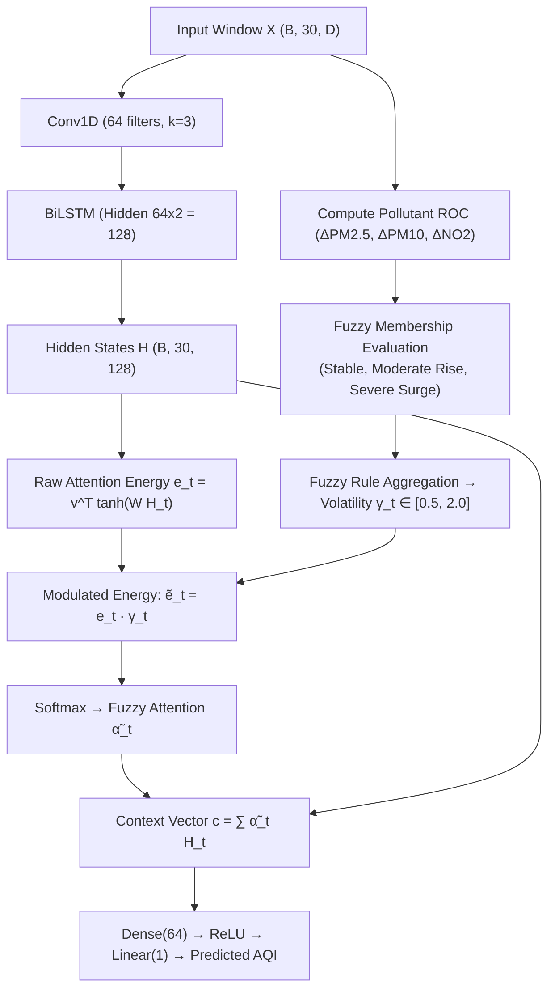

# AERIS: Model Specification & Deep Learning Design
**Adaptive Environmental Risk & Intelligence System**
*Mathematical Formulations & Architectural Designs*

---

## 1. Unified Tensor Dimensions & Data Contracts

All sequential deep learning models and tabular baselines operate on a standardized input-output contract.

### Primary Input Tensor Contract (Sequential DL)
* **Tensor Shape:** $\mathbf{X} \in \mathbb{R}^{B \times T \times D}$
  * $B$: Batch size (e.g., 32, 64, 128 during training; 1 during real-time single-window inference).
  * $T$: Temporal sequence length / Lookback window ($T = 30$ consecutive days).
  * $D$: Feature dimension ($D = 18$ normalized features: 12 raw pollutant/AQI features + 4 rate-of-change features + 2 cyclic time features).

### Flattened Input Contract (Tabular Baselines: XGBoost / LightGBM)
* **Feature Vector Shape:** $\mathbf{X}_{\text{flat}} \in \mathbb{R}^{B \times (T \cdot D + K)}$
  * Flattened raw window ($30 \times D = 540$ features).
  * Aggregated summary features ($K = 36$: 7-day and 14-day rolling mean, min, max, std of critical pollutants).

### Target Tensor Contract
* **Continuous Output Shape:** $\widehat{\mathbf{Y}} \in \mathbb{R}^{B \times 1}$ (Continuous predicted AQI for day $t+1$).
* **Categorical Mapping:** Post-processed scalar $\widehat{Y} \to \text{NAQI Bucket} \in \{\text{Good}, \text{Satisfactory}, \text{Moderate}, \text{Poor}, \text{Very Poor}, \text{Severe}\}$.

---

## 2. Model 1: XGBoost Baseline

* **Purpose:** High-performance gradient boosted decision tree baseline for tabularized time-series forecasting.
* **Input Format:** Flattened 2D feature matrix $(B, 576)$.
* **Output Format:** Continuous scalar $(B, 1)$.
* **Architecture:** Ensemble of gradient-boosted regression trees.
* **Provisional Hyperparameters:**
  * `n_estimators`: 300
  * `max_depth`: 6
  * `learning_rate`: 0.03
  * `subsample`: 0.8
  * `colsample_bytree`: 0.8
  * `tree_method`: `hist`
* **Loss Function:** Squared Error ($L_2$) / Huber Objective.
* **Training Strategy:** 5-fold expanding window cross-validation or strict chronological train/val split with 20-round early stopping.
* **Checkpoint Format:** `xgboost_baseline.joblib` containing model weights and feature column indices.

---

## 3. Model 2: LightGBM Baseline

* **Purpose:** Fast, leaf-wise gradient boosting baseline providing efficient feature splitting.
* **Input Format:** Flattened 2D feature matrix $(B, 576)$.
* **Output Format:** Continuous scalar $(B, 1)$.
* **Architecture:** Leaf-wise (best-first) gradient-boosted tree ensemble.
* **Provisional Hyperparameters:**
  * `n_estimators`: 400
  * `num_leaves`: 31
  * `learning_rate`: 0.03
  * `min_child_samples`: 20
  * `feature_fraction`: 0.8
* **Loss Function:** Huber / L1 Loss.
* **Training Strategy:** Chronological split with early stopping on validation RMSE.
* **Checkpoint Format:** `lightgbm_baseline.joblib`.

---

## 4. Model 3: Standard LSTM

* **Purpose:** Unidirectional recurrent deep learning baseline modeling forward temporal transitions.
* **Input Format:** 3D Tensor $(B, 30, D)$.
* **Output Format:** Continuous scalar $(B, 1)$.
* **Architecture:**
  1. Input: $(B, 30, D)$
  2. Multi-layer LSTM (2 layers, hidden size $H = 64$, dropout = 0.2): Output $(B, 30, 64)$
  3. Last time-step extraction: $\mathbf{h}_{30} \in \mathbb{R}^{B \times 64}$
  4. Fully Connected Head: Linear(64, 32) $\to$ ReLU $\to$ Dropout(0.2) $\to$ Linear(32, 1) $\to (B, 1)$
* **Provisional Hyperparameters:**
  * Hidden size: 64
  * Number of layers: 2
  * Learning rate: $1 \times 10^{-3}$ (AdamW)
  * Batch size: 64
* **Loss Function:** Huber Loss ($\delta = 1.0$).
* **Checkpoint Format:** `lstm.pt` (PyTorch state_dict + hyperparameter metadata).

---

## 5. Model 4: Bidirectional LSTM (BiLSTM)

* **Purpose:** Recurrent baseline capturing both forward progression and backward contextual dependencies across the 30-day window.
* **Input Format:** 3D Tensor $(B, 30, D)$.
* **Output Format:** Continuous scalar $(B, 1)$.
* **Architecture:**
  1. Input: $(B, 30, D)$
  2. BiLSTM Layer (2 layers, hidden size $H = 64$ per direction, `bidirectional=True`): Output $\mathbf{H} \in \mathbb{R}^{B \times 30 \times 128}$
  3. Concatenated final hidden states: $[\overrightarrow{\mathbf{h}}_{30}; \overleftarrow{\mathbf{h}}_{1}] \in \mathbb{R}^{B \times 128}$
  4. Fully Connected Head: Linear(128, 64) $\to$ LayerNorm $\to$ ReLU $\to$ Dropout(0.2) $\to$ Linear(64, 1) $\to (B, 1)$
* **Provisional Hyperparameters:**
  * Hidden size: 64 per direction (128 total)
  * Layers: 2
  * Learning rate: $8 \times 10^{-4}$
* **Loss Function:** Huber Loss.
* **Checkpoint Format:** `bilstm.pt`.

---

## 6. Model 5: Transformer Encoder

* **Purpose:** Self-attention baseline modeling multi-scale pairwise temporal relationships across all 30 days without recurrent step constraints.
* **Input Format:** 3D Tensor $(B, 30, D)$.
* **Output Format:** Continuous scalar $(B, 1)$.
* **Architecture:**
  1. Linear Projection: Linear($D$, 64) + 1D Sinusoidal Positional Encoding $\to (B, 30, 64)$
  2. Transformer Encoder Layers (3 layers, 4 attention heads, feedforward dimension 128, dropout 0.1) $\to (B, 30, 64)$
  3. Global Average Pooling over temporal dimension: $\mathbf{z} = \frac{1}{30}\sum_{t=1}^{30} \mathbf{h}_t \in \mathbb{R}^{B \times 64}$
  4. Linear Head: Linear(64, 32) $\to$ ReLU $\to$ Linear(32, 1) $\to (B, 1)$
* **Provisional Hyperparameters:**
  * $d_{\text{model}} = 64$, $n_{\text{head}} = 4$, $n_{\text{layers}} = 3$, $d_{\text{ff}} = 128$
  * Learning rate: $5 \times 10^{-4}$ with Warmup + Cosine Decay
* **Loss Function:** Smooth L1 Loss.
* **Checkpoint Format:** `transformer.pt`.

---

## 7. Model 6: CNN-BiLSTM Hybrid Architecture

* **Purpose:** Joint spatial-temporal network where 1D convolutions extract localized cross-pollutant signatures, and BiLSTM models sequential trajectories.
* **Input Format:** 3D Tensor $(B, 30, D)$.
* **Output Format:** Continuous scalar $(B, 1)$.
* **Mathematical Operations & Layer Transitions:**
  1. Permute to channel-first: $\mathbf{X}^T \in \mathbb{R}^{B \times D \times 30}$
  2. 1D Convolution: $\mathbf{F} = \text{ReLU}(\text{Conv1D}(D, 64, \text{kernel}=3, \text{padding}=1)) \in \mathbb{R}^{B \times 64 \times 30}$
  3. Permute back to sequence: $\mathbf{F}^T \in \mathbb{R}^{B \times 30 \times 64}$
  4. BiLSTM Layer: $\mathbf{H} = \text{BiLSTM}(\mathbf{F}^T) \in \mathbb{R}^{B \times 30 \times 128}$
  5. Dense Head on final step: Linear(128, 64) $\to$ LayerNorm $\to$ ReLU $\to$ Linear(64, 1) $\to (B, 1)$
* **Provisional Hyperparameters:**
  * Conv filters: 64, Kernel: 3, Stride: 1
  * BiLSTM hidden: 64 per direction
  * Learning rate: $7 \times 10^{-4}$
* **Checkpoint Format:** `cnn_bilstm.pt`.

---

## 8. Model 7: CNN-BiLSTM with Temporal Attention

* **Purpose:** Extends CNN-BiLSTM with Bahdanau temporal attention, learning an explicit importance weight $\alpha_t$ for each historical day.
* **Input Format:** 3D Tensor $(B, 30, D)$.
* **Output Format:** Tuple: Predicted AQI $(B, 1)$ and Attention Weights $(B, 30)$.
* **Mathematical Formulation:**
  1. Conv1D + BiLSTM representation: $\mathbf{H} = [\mathbf{h}_1, \dots, \mathbf{h}_{30}] \in \mathbb{R}^{B \times 30 \times 128}$
  2. Energy score computation:
     $$e_t = \mathbf{v}^T \tanh(\mathbf{W}_h \mathbf{h}_t + \mathbf{b}_h), \quad \mathbf{W}_h \in \mathbb{R}^{64 \times 128}, \, \mathbf{v} \in \mathbb{R}^{64}$$
  3. Attention normalization:
     $$\alpha_t = \frac{\exp(e_t)}{\sum_{k=1}^{30} \exp(e_k)}, \quad \sum_{t=1}^{30} \alpha_t = 1$$
  4. Context Vector:
     $$\mathbf{c} = \sum_{t=1}^{30} \alpha_t \mathbf{h}_t \in \mathbb{R}^{B \times 128}$$
  5. Output Head: Linear(128, 64) $\to$ ReLU $\to$ Linear(64, 1) $\to (B, 1)$
* **Checkpoint Format:** `cnn_bilstm_temp_attn.pt`.

---

## 9. Model 8: Flagship Model — CNN-BiLSTM with Fuzzy Attention

* **Purpose:** Modulates neural temporal attention with domain-grounded pollutant rate-of-change ($\text{ROC}$) dynamics using fuzzy logic membership functions.



### Detailed 6-Step Mathematical Formulation

#### Step 1: Input Signals
Let $\mathbf{X}_t \in \mathbb{R}^D$ contain pollutant concentrations at day $t \in [1, 30]$. Primary volatility indicators are chosen as $p \in \{\text{PM}_{2.5}, \text{PM}_{10}, \text{NO}_2\}$.

#### Step 2: Rate-of-Change (ROC) Calculation
For each pollutant $p$:
$$\Delta X_{t, p} = \frac{X_{t, p} - X_{t-1, p}}{X_{t-1, p} + \epsilon}, \quad \text{with } \epsilon = 10^{-3}$$
Composite Volatility Score:
$$\Delta \bar{X}_t = 0.5 \cdot \Delta X_{t, \text{PM}_{2.5}} + 0.3 \cdot \Delta X_{t, \text{PM}_{10}} + 0.2 \cdot \Delta X_{t, \text{NO}_2}$$

#### Step 3: Fuzzy Membership Functions
$\Delta \bar{X}_t$ is mapped into three fuzzy sets:
1. **Stable / Neutral ($\mu_{\text{stable}}$):** Gaussian curve:
   $$\mu_{\text{stable}}(\Delta \bar{X}_t) = \exp\left( -\frac{(\Delta \bar{X}_t)^2}{2\sigma^2} \right), \quad \sigma = 0.10$$
2. **Moderate Increase ($\mu_{\text{moderate}}$):** Trapezoidal curve defined on $[a, b, c, d] = [0.05, 0.15, 0.30, 0.45]$:
   $$\mu_{\text{moderate}}(u) = \max\left(0, \min\left(\frac{u - 0.05}{0.10}, 1, \frac{0.45 - u}{0.15}\right)\right)$$
3. **Severe Surge ($\mu_{\text{surge}}$):** Upper-shoulder Sigmoid/Trapezoid ($u \ge 0.35$):
   $$\mu_{\text{surge}}(u) = \frac{1}{1 + \exp(-15(u - 0.35))}$$

#### Step 4: Fuzzy Aggregation
The fuzzy memberships are combined into a scalar multiplier $\gamma_t \in [0.5, 2.0]$:
$$\gamma_t = 1.0 + 0.5 \cdot \mu_{\text{moderate}}(\Delta \bar{X}_t) + 1.0 \cdot \mu_{\text{surge}}(\Delta \bar{X}_t) - 0.3 \cdot \mu_{\text{stable}}(\Delta \bar{X}_t)$$

#### Step 5: Attention Modulation & Normalization
$$\tilde{e}_t = e_t \cdot \gamma_t = \left(\mathbf{v}^T \tanh(\mathbf{W}_h \mathbf{h}_t + \mathbf{b}_h)\right) \cdot \gamma_t$$
$$\tilde{\alpha}_t = \frac{\exp(\tilde{e}_t)}{\sum_{k=1}^{30} \exp(\tilde{e}_k)}$$
Context Vector:
$$\mathbf{c}_{\text{fuzzy}} = \sum_{t=1}^{30} \tilde{\alpha}_t \mathbf{h}_t \in \mathbb{R}^{B \times 128}$$

#### Step 6: Regression Output
$$\widehat{\text{AQI}}_{t+1} = \mathbf{W}_2 \left(\text{ReLU}(\mathbf{W}_1 \mathbf{c}_{\text{fuzzy}} + \mathbf{b}_1)\right) + b_2$$

---

## 10. Intermediate Tensor Shapes Summary

| Module / Layer | Input Shape | Output Shape | Parameters / Dimension |
| :--- | :--- | :--- | :--- |
| **Input Batch** | — | $(B, 30, 18)$ | 18 features, 30 days |
| **Conv1D Layer** | $(B, 18, 30)$ | $(B, 64, 30)$ | $k=3, s=1, p=1$ |
| **BiLSTM Layer** | $(B, 30, 64)$ | $(B, 30, 128)$ | $H=64$ per direction |
| **Fuzzy ROC Engine** | $(B, 30, 18)$ | $(B, 30, 1)$ | Membership multipliers $\gamma_t$ |
| **Fuzzy Attention Head** | $(B, 30, 128) \times (B, 30, 1)$ | $(B, 30)$ | Normalized weights $\tilde{\alpha}_t$ |
| **Context Vector** | $(B, 30, 128) \times (B, 30)$ | $(B, 128)$ | Weighted sum $\sum \tilde{\alpha}_t \mathbf{h}_t$ |
| **Dense Projection** | $(B, 128)$ | $(B, 64)$ | Linear + LayerNorm + ReLU |
| **Output Head** | $(B, 64)$ | $(B, 1)$ | Linear scalar regression |

---

## 11. Systematic Ablation Study Plan

To isolate and prove the contribution of every architectural component, the following ablation grid will be executed during evaluation benchmarking:

| Ablation Variant | Conv1D | BiLSTM | Temporal Attention | Fuzzy ROC Modulation | Target Research Question |
| :--- | :---: | :---: | :---: | :---: | :--- |
| **Ablation 1 (BiLSTM Only)** | ❌ | ✅ | ❌ | ❌ | Baseline sequence recurrence |
| **Ablation 2 (CNN-BiLSTM)** | ✅ | ✅ | ❌ | ❌ | Isolates Conv1D spatial feature extraction |
| **Ablation 3 (CNN-LSTM + Temp Attn)**| ✅ | ❌ (Unidir) | ✅ | ❌ | Evaluates bidirectional vs unidirectional |
| **Ablation 4 (CNN-BiLSTM + Temp Attn)**| ✅ | ✅ | ✅ | ❌ | Standard attention baseline |
| **Ablation 5 (Full Flagship AERIS)**| ✅ | ✅ | ✅ | ✅ | **Evaluates novel Fuzzy Attention contribution** |

---

## 12. Training Strategy, Loss Functions & Checkpointing

* **Primary Loss:** Huber Loss ($\delta = 1.0$), transitioning smoothly between quadratic penalty for small errors and linear penalty for large outlier spikes:
  $$L_\delta(y, \hat{y}) = \begin{cases} 0.5 (y - \hat{y})^2 & \text{for } |y - \hat{y}| \le \delta \\ \delta (|y - \hat{y}| - 0.5 \delta) & \text{otherwise} \end{cases}$$
* **Optimizer:** AdamW ($\text{lr} = 7 \times 10^{-4}$, weight_decay = $10^{-4}$).
* **LR Schedule:** `CosineAnnealingLR` with $T_{\max} = 50$, $\eta_{\min} = 10^{-6}$.
* **Gradient Clipping:** Max norm = 1.0 to prevent exploding gradients during severe pollution surges.
* **Early Stopping:** Patience = 12 epochs monitoring Validation RMSE.
* **Checkpoint Format:** Standard `.pt` bundle containing:
  ```python
  {
      "model_state_dict": model.state_dict(),
      "model_name": "cnn_bilstm_fuzzy_attn",
      "input_dim": 18,
      "hidden_dim": 64,
      "epoch": best_epoch,
      "val_rmse": best_val_rmse,
      "scaler_metadata": scaler_meta,
      "timestamp": "2026-09-27T18:00:00Z"
  }
  ```
