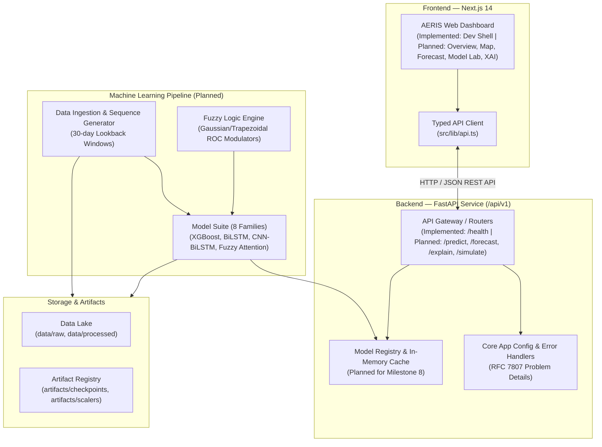

# AERIS
**Adaptive Environmental Risk & Intelligence System**

AERIS is an environmental intelligence platform focused on short-term air quality forecasting using time-series machine learning, deep learning, and fuzzy attention. The project combines a forecasting backend with an interactive interface for examining air quality trends, model behavior, and prediction uncertainty where supported.

---

## Key Objectives

* **Short-Term AQI Forecasting:** Predict single-day-ahead ($t+1$) continuous Air Quality Index (AQI) values using 30-day historical multi-pollutant sequences ($\text{PM}_{2.5}, \text{PM}_{10}, \text{NO}_2, \text{SO}_2, \text{CO}, \text{O}_3$, etc.).
* **Model Family Comparison:** Systematically benchmark conventional gradient-boosted decision trees (XGBoost, LightGBM) against sequential deep-learning architectures (LSTM, BiLSTM, Transformer) and hybrid neural models.
* **Temporal Attention Investigation:** Evaluate whether temporal attention mechanisms can identify critical historical accumulation periods that precede high-pollution events.
* **Fuzzy Attention Evaluation:** Investigate fuzzy logic-modulated attention as an experimental research direction to incorporate pollutant rate-of-change ($\text{ROC}$) dynamics directly into neural attention representations.
* **Interactive Visualization & Analysis:** Provide an analytical web interface for exploring historical trends, comparing model metrics, inspecting attention weights, and testing hypothetical pollutant reduction scenarios.

---

## Technology Stack

### Frontend
* **Framework:** Next.js 14 (App Router)
* **Language:** TypeScript
* **UI & Styling:** Tailwind CSS, shadcn/ui primitives
* **Visualization:** Recharts, Lucide React

### Backend
* **Language:** Python 3.10+
* **Framework:** FastAPI
* **Data Validation & Settings:** Pydantic v2, Pydantic-Settings
* **ASGI Server:** Uvicorn

### Machine Learning (Core Libraries)
* **Deep Learning:** PyTorch 2.x
* **Tabular & Boosting:** XGBoost, LightGBM, Scikit-learn
* **Data Manipulation:** NumPy, Pandas

### Infrastructure & Tooling
* **Containers:** Docker, Docker Compose
* **Testing:** pytest, pytest-asyncio
* **Code Quality:** Ruff, ESLint, Prettier
* **Version Control:** Git

---

## System Architecture

The AERIS platform follows a modular architecture separating data processing and model serving from the presentation layer.



*Note: The frontend development shell, FastAPI core, configuration, error handling, Docker configuration, and the `/api/v1/health` endpoint are fully operational. Data pipelines, ML model training, and advanced analytical views are planned in subsequent milestones.*

---

## Forecasting Methodology

The planned research and forecasting methodology comprises:

* **Dataset:** Historical multi-city daily air quality records compiled from Central Pollution Control Board (CPCB) monitoring stations across India.
* **Lookback Window:** A sliding window of 30 consecutive calendar days ($T=30$) containing normalized multi-pollutant features and temporal encodings.
* **Prediction Target:** Continuous scalar $\text{AQI}_{t+1}$ on the subsequent day, categorized post-prediction into standard Indian National AQI (NAQI) hazard buckets.
* **Leak-Free Partitioning:** Chronological splitting (70% Train, 15% Validation, 15% Test) performed strictly within individual cities. Feature scalers are fitted exclusively on the training partition.
* **Evaluation Metrics:** Regression performance evaluated via RMSE, MAE, $R^2$, and MAPE. Categorical accuracy evaluated via Macro F1, overall accuracy, and Severe-bucket recall.

---

## Repository Structure

```
AERIS/
├── frontend/                     # Next.js 14 analytical frontend
│   ├── app/                      # App router layouts and pages
│   ├── lib/                      # API client and utility helpers
│   ├── types/                    # TypeScript interfaces
│   ├── package.json              # Node.js dependencies
│   ├── tsconfig.json             # TypeScript configuration
│   ├── tailwind.config.ts        # Tailwind styling & NAQI colors
│   └── Dockerfile                # Multi-stage frontend Dockerfile
│
├── backend/                      # FastAPI backend service
│   ├── app/
│   │   ├── api/v1/               # API endpoints & router definition
│   │   ├── core/                 # App configuration, logging, and errors
│   │   ├── schemas/              # Pydantic v2 request/response models
│   │   ├── services/             # Business logic (forecasting, fuzzy, XAI)
│   │   ├── data/                 # Ingestion and sequence generation
│   │   └── main.py               # Application factory and lifespan
│   ├── tests/                    # Pytest test suite
│   ├── requirements.txt          # Pinned Python dependencies
│   ├── pyproject.toml            # Backend package configuration
│   └── Dockerfile                # Multi-stage backend Dockerfile
│
├── data/                         # Dataset storage (git-ignored)
│   ├── raw/                      # Raw CPCB city_day.csv
│   └── processed/                # Processed Parquet tables & tensors
│
├── artifacts/                    # Serialized models & metrics (git-ignored)
│   ├── scalers/                  # Fitted feature scalers (.joblib)
│   ├── checkpoints/              # Model weights (.pt, .joblib)
│   └── metrics/                  # Benchmark JSON summaries
│
├── docs/                         # Technical documentation & guides
├── scripts/                      # Utility scripts
├── docker-compose.yml            # Multi-service container orchestration
├── .env.example                  # Environment template
├── .gitignore                    # Git ignore rules
├── README.md                     # Project overview and setup guide
│
├── PROJECT_SPEC.md               # Requirements & functional specification
├── ARCHITECTURE.md               # System architecture & component design
├── DEVELOPMENT_PLAN.md           # Engineering roadmap & milestones
├── RESEARCH_BASELINE.md          # Research baseline & methodology review
├── MODEL_SPECIFICATION.md        # Mathematical model & deep learning design
├── API_SPECIFICATION.md          # OpenAPI 3.1 REST contracts
└── DASHBOARD_SPECIFICATION.md    # UI/UX design & page specifications
```

---

## Current Development Status

| Milestone | Description | Status |
| :--- | :--- | :---: |
| **Milestone 1 — Project Foundation** | Requirements, architecture, model math, API contracts, UI blueprints | **Complete** |
| **Milestone 2 — Application Infrastructure** | Monorepo structure, FastAPI core, Next.js dev shell, tests, Docker config | **Complete** |
| **Milestone 3 — Data Acquisition & Validation** | Ingestion pipeline, schema validation, data profiling | *Next / Pending* |
| **Milestone 4 — Data Preparation** | Leak-free splitting, missing value imputation, 30-day sequence builder | *Pending* |
| **Milestone 5 — Forecasting Models** | Tabular baselines (XGBoost/LightGBM), sequential DL (LSTM/BiLSTM/Transformer) | *Pending* |
| **Milestone 6 — Attention & Fuzzy Intelligence** | Temporal attention and fuzzy rate-of-change attention integration | *Pending* |
| **Milestone 7 — Evaluation & Explainability** | Multi-model benchmark suite, ablation experiments, XAI feature attributions | *Pending* |
| **Milestone 8 — Application Integration** | REST prediction endpoints and full 9-page analytical dashboard views | *Planned* |
| **Milestone 9 — Deployment & Validation** | End-to-end integration tests and containerized validation | *Planned* |

---

## Getting Started

### Prerequisites
* **Python:** 3.10, 3.11, 3.12, or 3.13
* **Node.js:** 18.x, 20.x, or 22.x (`npm` 9+)
* **Docker & Docker Compose:** (Optional, for containerized execution)

---

### 1. Environment Configuration

Copy the example environment file to create your local `.env`:

```bash
cp .env.example .env
```

Key configuration defaults:
```env
ENVIRONMENT=development
DEBUG=True
BACKEND_HOST=0.0.0.0
BACKEND_PORT=8000
FRONTEND_PORT=3000
NEXT_PUBLIC_API_URL=http://localhost:8000
CORS_ORIGINS=http://localhost:3000,http://127.0.0.1:3000
```

---

### 2. Backend Setup & Verification

1. Install Python dependencies:
   ```bash
   pip install -r backend/requirements.txt
   ```

2. Run code quality checks:
   ```bash
   ruff check backend/
   ```

3. Run automated backend tests:
   ```bash
   pytest
   ```

4. Start the FastAPI development server:
   ```bash
   python -m uvicorn backend.app.main:app --host 0.0.0.0 --port 8000 --reload
   ```

5. Verify the service health endpoint:
   ```bash
   curl http://localhost:8000/api/v1/health
   ```
   *Expected JSON response:*
   ```json
   {
     "status": "healthy",
     "project": "AERIS",
     "version": "1.0.0",
     "environment": "development",
     "uptime_seconds": 5.21,
     "device": "cpu",
     "models_loaded": [],
     "dataset_version": "city_day_v1.0"
   }
   ```

---

### 3. Frontend Setup

1. Navigate to the frontend directory and install dependencies:
   ```bash
   cd frontend
   npm install
   ```

2. Run type checking and linting:
   ```bash
   npm run type-check
   npm run lint
   ```

3. Build or start the development server:
   ```bash
   npm run dev
   ```
   Open [http://localhost:3000](http://localhost:3000) in your browser to view the application shell.

---

### 4. Docker Compose Setup

To start both services in isolated containers:

```bash
# Build and launch containers in detached mode
docker compose up --build -d

# Verify service health status
docker compose ps

# View service logs
docker compose logs -f

# Shut down containers
docker compose down
```

---

## Research Considerations

* **Temporal Data Leakage Prevention:** Standard k-fold cross-validation is inappropriate for auto-correlated environmental time-series. AERIS enforces strict chronological splitting per city.
* **Train-Only Scaler Fitting:** Feature normalization parameters (means, standard deviations, min/max bounds) are computed exclusively on the training partition and applied without modification to validation and test partitions.
* **Baseline Fairness:** All model families (GBDTs, RNNs, Transformers, Hybrid Networks) are trained and evaluated on identical input sequences and test folds.
* **Historical vs. Live Data:** Current development utilizes historical daily CPCB records. Live data feeds and real-time inference buffers will be clearly distinguished from historical benchmarks.

---

## Technical Documentation Suite

* [PROJECT_SPEC.md](PROJECT_SPEC.md) — Comprehensive requirements and problem formulation.
* [ARCHITECTURE.md](ARCHITECTURE.md) — System architecture, data flow, and serving design.
* [DEVELOPMENT_PLAN.md](DEVELOPMENT_PLAN.md) — Engineering milestones and decision tracker.
* [RESEARCH_BASELINE.md](RESEARCH_BASELINE.md) — Historical research review and anti-leakage methodology.
* [MODEL_SPECIFICATION.md](MODEL_SPECIFICATION.md) — Mathematical specifications for all 8 model families.
* [API_SPECIFICATION.md](API_SPECIFICATION.md) — OpenAPI 3.1 REST schema contracts.
* [DASHBOARD_SPECIFICATION.md](DASHBOARD_SPECIFICATION.md) — UI/UX wireframes and analytical views.

---

## License

This project is available under the MIT License. See `LICENSE` for details.
